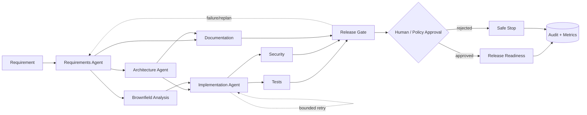

# Architecture and orchestration model

## Why a DAG instead of a linear chain?

- Requirements and architecture are prerequisites, but documentation and some validation work can run in parallel.
- Security and tests synchronize before release.
- Brownfield work adds a dependency only for brownfield runs.
- Each node has state, attempts, outputs, errors and decision lineage.
- Upstream requirement changes trigger re-planning of affected downstream nodes.

## Governance

- High-impact implementation/release stages can require explicit human approval.
- Policy checks reject forbidden actions and block release without security validation.
- Bounded retries prevent infinite autonomous loops.
- Safe-stop preserves state when policy or human review fails.
- Rollback is an explicit operator action and is recorded in the audit trail.

## Observability

Each run records node start/success/retry/failure, policy decisions, approvals, replans, rollback and final status. Metrics exposed by run state include success rate, retries, rollback count, end-to-end latency and MTTR proxy.

For a production deployment, the in-memory run registry should be replaced with a durable workflow/state store and metrics should be emitted to OpenTelemetry/Prometheus.
